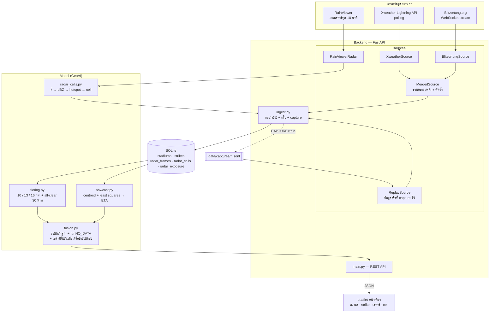
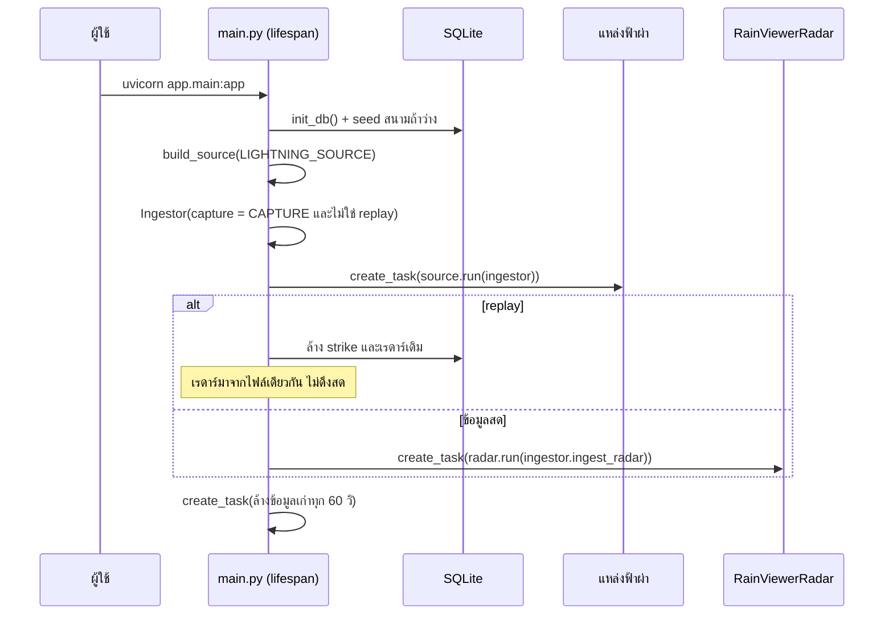
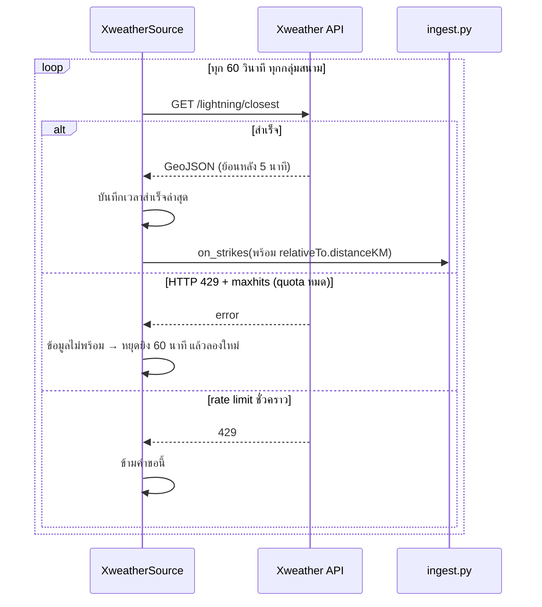
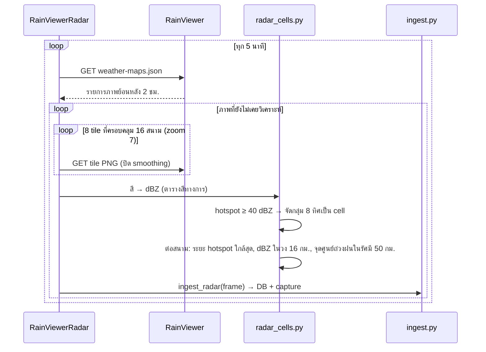
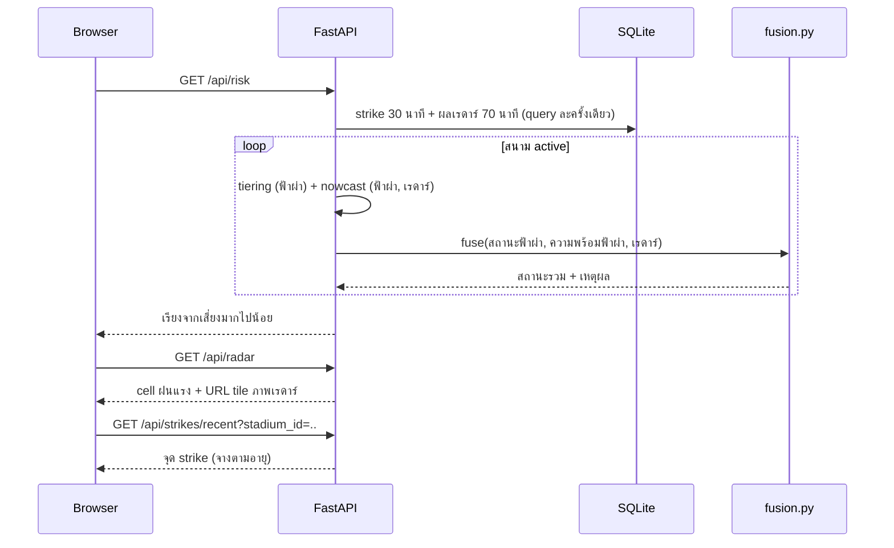
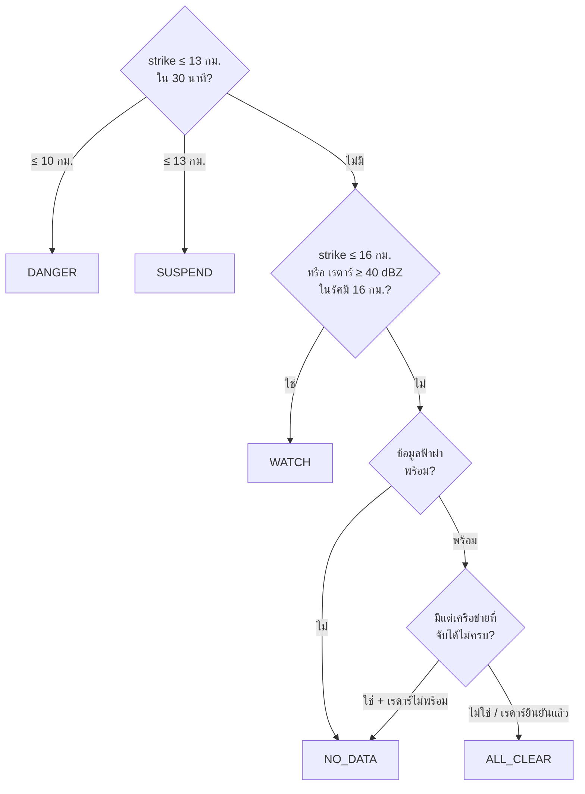
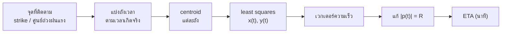
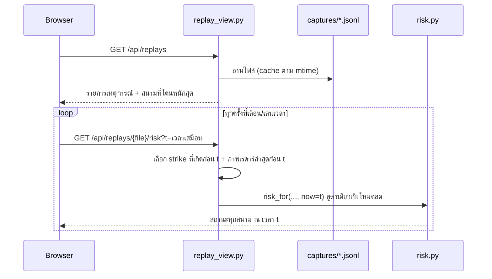

# เอกสารออกแบบระบบ — GeoAI-for-Disaster: แจ้งเตือนฟ้าผ่าล่วงหน้าสำหรับสนามไทยลีก 1

> ⚠ **ต้นแบบเชิงวิชาการ — ไม่ใช่ระบบเตือนภัยสำหรับตัดสินใจจริง**
> ตำแหน่งฟ้าผ่าและฝนมีความคลาดเคลื่อนตามข้อจำกัดของเครือข่ายตรวจจับที่ใช้
> Radar data © RainViewer

---

## 1. โจทย์และขอบเขต

ฟ้าผ่าเป็นภัยที่คร่าชีวิตคนในสนามกีฬากลางแจ้งได้จริง และเป็นภัยที่ *เตือนล่วงหน้าได้*
เพราะพายุฝนฟ้าคะนองเคลื่อนที่ด้วยความเร็วที่พอคาดการณ์ได้ (ราว 30–60 กม./ชม.)
ระบบนี้ตอบสองคำถามสำหรับสนามไทยลีก 1 ฤดูกาล 2026-27 ทั้ง 16 สนาม:
*ตอนนี้* ควรหยุดแข่งหรือยัง และ *อีกกี่นาที* พายุจะมาถึง

**ในขอบเขต:** รับข้อมูลฟ้าผ่าและเรดาร์ฝนจริง, วิเคราะห์ cell ฝนแรงจากภาพเรดาร์, รวมหลักฐาน
เป็นสถานะเดียว, nowcast ระยะสั้น, แผนที่, capture/replay ข้อมูลจริงสำหรับ demo

**นอกขอบเขต:** ระบบผู้ใช้, การแจ้งเตือน push/SMS, การใช้ตัดสินใจด้านความปลอดภัยจริง

**หลักการ:** ใช้ข้อมูลจริงเท่านั้น ไม่มีโหมดข้อมูลจำลอง

---

## 2. สถาปัตยกรรม



| ชั้น | ไฟล์ | หน้าที่ |
|------|------|--------|
| Source adapter | `app/sources/` | คุยกับแหล่งข้อมูล แปลงเป็นรูปแบบกลาง รายงานความพร้อมของข้อมูล |
| Ingest | `app/ingest.py` | กรองระยะ, คำนวณระยะต่อสนาม, เขียน DB, capture |
| Database | `app/db.py` | เก็บสนาม, strike, ผลวิเคราะห์เรดาร์ และล้างข้อมูลเก่า |
| Model | `app/model/` | วิเคราะห์เรดาร์, ตัดสินสถานะ, พยากรณ์ ETA, รวมหลักฐาน |
| API | `app/main.py` | ประกอบ JSON, เสิร์ฟ static, เปิดตัวรับข้อมูล |
| Frontend | `static/` | แผนที่, legend, layer toggle, badge แหล่งข้อมูล |

### ข้อตัดสินใจหลัก

**1. interface เดียวรองรับ push, pull และ replay**

```python
class LightningSource(ABC):
    async def run(self, on_strikes: Callable[[list[Strike]], None]) -> None: ...
    def availability(self) -> tuple[bool, str | None]: ...
```

**2. แยก "ข้อมูลว่าง" ออกจาก "ไม่มีข้อมูล"** ทุกแหล่งข้อมูลต้องรายงานว่าพร้อมหรือไม่
ถ้าไม่พร้อม ระบบห้ามตอบว่าปลอดภัย (ดูหัวข้อ 5.1)

---

## 3. การไหลของข้อมูล

### 3.1 เริ่มระบบ



### 3.2 ฟ้าผ่า: Xweather polling และการจัดการ quota



เคสที่ทำให้ต้องออกแบบแบบนี้ (พบจริง 2026-09-16): เวอร์ชันก่อนเหมารวม 429 เป็น rate limit
ชั่วคราว ทำให้ quota หมดแล้วยังยิงซ้ำทุก 4 วินาที และหน้าเว็บขึ้นทุกสนามเป็นปลอดภัยทั้งที่ไม่มีข้อมูล

### 3.3 เรดาร์: RainViewer → cell → ระยะถึงสนาม



### 3.4 ผู้ใช้เปิดหน้าเว็บ (ทุก 30 วินาที)



---

## 4. แบบจำลองข้อมูล

```
stadiums (id, club, name, lat, lon, capacity, status, note)
    │
    ├──< strikes (id, stadium_id, ts_iso, lat, lon, distance_km, source, received_at)
    │       INDEX (stadium_id, ts_iso) · UNIQUE (stadium_id, ts_iso, lat, lon)
    │
    └──< radar_exposure (frame_ts, stadium_id, nearest_hotspot_km, max_dbz_watch,
                          activity_lat, activity_lon, activity_pixels)
                 │
radar_frames (frame_ts PK, source, tiles_ok, tiles_total, max_dbz, received_at)
    └──< radar_cells (id, frame_ts, lat, lon, max_dbz, pixels, area_km2)
```

- **ไม่ใช้ PostGIS** — lat/lon เป็น REAL ธรรมดา คำนวณ haversine ใน Python
- **เก็บผลวิเคราะห์ ไม่เก็บภาพดิบ** — ภาพเรดาร์ 1 ภาพเหลือไม่กี่ KB ต่อภาพ
- **เวลาเป็นเวลาเกิดจริง** (ISO-8601 UTC) เปรียบเทียบระดับสตริงใน SQL ได้
- **`source`** ทุกแถวบอกได้ว่ามาจากไหน รวมถึง replay จากไฟล์ใด
- strike เก็บ 60 นาที, เรดาร์เก็บ 3 ชม. dataset ระยะยาวให้ใช้ capture

---

## 5. ตรรกะการตัดสินใจ

### 5.1 Fusion



- **ฟ้าผ่าเท่านั้นสั่ง SUSPEND / DANGER** เพราะเกณฑ์ NCAA นิยามจากระยะฟ้าผ่า และฝนหนัก
  ไม่ได้แปลว่ามีฟ้าผ่า ถ้าให้เรดาร์สั่งหยุด อัตราเตือนผิดจะสูงจนระบบไม่น่าเชื่อถือ
- **เรดาร์ทำให้ขึ้น WATCH ได้** ลดจุดบอดของเครือข่ายตรวจฟ้าผ่า (ไม่ใช่ขจัดจุดบอด —
  เรดาร์เองก็มีภาพทุก 10 นาที มี latency และบางตัวล่มได้)
- **ไม่มีข้อมูลฟ้าผ่า + ไม่มีหลักฐานอื่น = NO_DATA** ไม่ใช่ ALL_CLEAR
- **เครือข่ายที่จับได้ไม่ครบ (Blitzortung ในไทย) ต้องมีเรดาร์ยืนยัน** — ถ้าแหล่งที่พร้อมใช้ทั้งหมด
  เป็นแบบ sparse การไม่เห็นฟ้าผ่ายังไม่พอ ต้องมีภาพเรดาร์ที่ไม่พบฝนแรงในวง 16 กม. จึงขึ้น ALL_CLEAR
- **หลักฐานเดิมไม่หาย** — quota หมดกลางพายุ strike ที่เก็บแล้วยังทำให้ SUSPEND ต่อไปจนครบ 30 นาที

### 5.2 วงรัศมีและนาฬิกา all-clear

```
นาฬิกา all-clear = strike ล่าสุดที่ ≤ 13 กม. + 30 นาที
```

13 กม. ≈ 8 ไมล์ = เกณฑ์ระงับแข่งของ NCAA, all-clear 30 นาทีเป็นมาตรฐาน
strike ที่ 15 กม. ทำให้ขึ้น WATCH แต่ **ไม่** รีเซ็ตนาฬิกา

### 5.3 Nowcast (ใช้กับทั้งฟ้าผ่าและเรดาร์)



```
(vx² + vy²)·t²  +  2(x₀vx + y₀vy)·t  +  (x₀² + y₀² − R²)  =  0
```

| | ฟ้าผ่า | เรดาร์ |
|--|-------|-------|
| หน้าต่าง / ถัง | 20 / 5 นาที | 40 / 10 นาที |
| R | 13 กม. (สั่งหยุด) | 16 กม. (เฝ้าระวัง) |

ผลเป็น `null` พร้อมเหตุผลเมื่อข้อมูลไม่พอหรือทิศไม่ชัด สำหรับระบบที่เกี่ยวกับความปลอดภัย
การบอกว่าไม่รู้มีค่ามากกว่าตัวเลขที่ไม่มีฐานรองรับ

**ข้อจำกัด:** สมมติเคลื่อนที่เป็นเส้นตรงความเร็วคงที่ ไม่จำลองการก่อตัว/สลายตัวของ cell
จุดศูนย์ถ่วงของฝนรอบสนามอาจกระโดดเมื่อมีหลาย cell ในรัศมี 50 กม.

### 5.4 ตรวจ cell ฝนแรงจากภาพเรดาร์

1. สี pixel → dBZ ด้วยตารางสีทางการของ RainViewer (ขอภาพปิด smoothing จึงตรงตาราง 100%
   สีที่ไม่ตรงตารางถูกนับไว้ตรวจคุณภาพ ไม่ถูกเดาค่า)
2. hotspot = pixel ≥ 40 dBZ (ตัวแทนฝนฟ้าคะนองแบบ convective ที่ใช้กันทั่วไป — เป็นค่าประมาณ)
3. จัดกลุ่ม hotspot ติดกัน 8 ทิศด้วย BFS เป็น cell ตัดกลุ่มที่เล็กกว่า 4 pixel (~6 ตร.กม.)
4. ภาพเป็นค่าสะท้อนรวมทุกความสูง บอกได้ว่ามีฝนแรง แต่บอกไม่ได้ว่ามีประจุไฟฟ้า

---

## 6. ข้อมูลจริงและ replay

| โหมด | ข้อมูล | ใช้เพื่อ | แสดงบน UI |
|------|--------|---------|-----------|
| xweather / blitzortung + เรดาร์สด | จริง สด | ระบบใช้งานจริง | badge เขียว |
| replay | จริง เลื่อนเวลา (ฟ้าผ่า + ผลเรดาร์) | demo วันที่ฟ้าใส | badge ฟ้า + วันเวลาต้นฉบับ |

replay เลื่อนทุก record ด้วยค่าคงที่เดียว ความสัมพันธ์ทางเวลาระหว่างฟ้าผ่ากับเรดาร์จึงเหมือนต้นฉบับ
(ที่ `REPLAY_SPEED=1`) ระหว่าง replay ระบบไม่ดึงเรดาร์สด เพื่อไม่ให้ข้อมูลต่างเวลาปนกัน

### Replay บนหน้าเว็บ

หน้าเว็บมีโหมด **Replay พายุจริง** ที่ไม่ต้องรีสตาร์ทและไม่แตะข้อมูลสด:



เพราะคำนวณ ณ เวลาเสมือน (ส่ง `now=t` เข้า tiering และ nowcast) การเล่นเร็ว 60 เท่าจึงไม่ทำให้
ความเร็วพายุหรือนาฬิกา all-clear เพี้ยน ต่างจาก `LIGHTNING_SOURCE=replay` ที่บีบเวลาจริง

ข้อสมมติ: ไฟล์ capture ไม่ได้บันทึกช่วงที่แหล่งข้อมูลล่ม จึงถือว่าข้อมูลฟ้าผ่าพร้อมตลอดช่วงที่บันทึก

ข้อมูลสังเคราะห์มีเฉพาะใน `tests/` เพื่อตรวจความถูกต้องของสูตร ไม่เชื่อมกับระบบที่รันจริง

---

## 7. ข้อจำกัดภายนอกและการปฏิบัติตามเงื่อนไข

| ประเด็น | การรับมือ |
|---------|-----------|
| Xweather quota หมด (HTTP 429 `maxhits`) | หยุดยิง, แจ้ง `NO_DATA`, ลองใหม่ทุก 60 นาที |
| Xweather ย้อนหลังได้แค่ 5 นาที | poll ทุก 60 วิ ข้อมูลซ้อนกัน ตัวซ้ำกรองที่ DB |
| credential ของ Xweather อยู่ใน URL | อ่านจาก `.env`, ปิด log ของ httpx |
| Blitzortung ครอบคลุมไทยแต่จับได้ไม่ครบ (วัดจริง) | ใช้เป็นแหล่งฟรีที่สดตลอด คู่กับกฎเรดาร์ยืนยันก่อน ALL_CLEAR และตรวจ stream ค้าง |
| ไม่มีแหล่งฟรีแหล่งเดียวที่ครบ | รัน `blitzortung,xweather` พร้อมกัน ตัดฟ้าผ่าซ้ำ (≤ 1 วิ, ≤ 5 กม.) |
| Blitzortung: ห้ามใช้เพื่อ safety/commercial, raw data เป็นของเจ้าของสถานี | ระบุเป็นความเสี่ยงในรายงาน |
| RainViewer: งานส่วนตัว/การศึกษาเท่านั้น ต้องให้เครดิต | เครดิตบนหน้าเว็บ, README, API |
| RainViewer: zoom สูงสุด 7, 100 คำขอ/นาที, ไม่มีภาพพยากรณ์ | วิเคราะห์ที่ zoom 7, เว้นคำขอ 0.7 วิ, ทำ nowcast เอง |
| RainViewer: ไม่รับประกันความพร้อม | ภาพเก่าเกิน 30 นาที = เรดาร์ไม่พร้อม |
| TMD ไม่มี API เรดาร์ | ไม่ได้ใช้ |

---

## 8. คุณภาพข้อมูลนำเข้า

| สนาม | ปัญหา | ระบบทำอย่างไร |
|------|-------|---------------|
| Chonburi Daikin Stadium | เดิมพิกัดจาก geocoding | ตรวจแล้ว 2026-09-17 แก้เป็น 13.3362003, 100.9564479 |
| Sisaket Provincial Stadium (Rasisalai United) | `note=verify` พิกัดจาก geocoding | `location_unverified: true` + ⚑ บน UI |
| True BG Stadium | ใช้ร่วม 2 สโมสร | สถานะแยกรายสโมสร, Xweather ยุบเป็น cluster เดียว |
| Rainbow Stadium (Pattani) | ปรับปรุงอยู่ | `status=future` ไม่เฝ้าระวัง |

พิกัดที่ติดธงยังไม่ได้ยืนยัน และระบบไม่ได้แก้พิกัดเอง

---

## 9. สถานะการทดสอบ

| ส่วน | ผล |
|------|----|
| Xweather กับ API จริง | 2026-09-14: strike จริง 40 จุด ระยะตรง haversine ±1 ม. / 2026-09-16: บันทึกพายุจริง 55 strike ใกล้สุด 5.6 กม. จากสนาม Sam Ao |
| Xweather quota หมด | 2026-09-17: หยุดยิงหลัง 1 คำขอ, ทุกสนาม `NO_DATA` |
| RainViewer กับข้อมูลจริง | 2026-09-17: 13 ภาพ x 8 tile, 105 คำขอ ไม่มี error, dBZ สูงสุด 55, cell 24 cell |
| Blitzortung stream สด | ต่อติด มีข้อมูลเอเชียจริง แต่ในไทยความถี่ต่ำ (2026-09-15: 0 จาก 2,198 จุด / 2026-09-17: เอเชีย 37 จุดใน 150 วินาที) |
| unit test (offline) | 143 ข้อ: tiering/nowcast 21, LZW 17, pipeline 15, availability/fusion/หลายแหล่ง 41, radar 31, replay บนเว็บ 18 |

ยังไม่ได้เห็นกรณีที่เรดาร์ทำให้สนามขึ้น WATCH กับข้อมูลจริง (วันที่ทดสอบไม่มี cell ใกล้สนาม)
กรณีนี้ยืนยันด้วย unit test เท่านั้น

## 10. ต่อยอด

1. เก็บ capture ที่มีทั้งฟ้าผ่าและเรดาร์ช่วงพายุ เพื่อวัดว่าเรดาร์เตือนล่วงหน้าก่อนฟ้าผ่ากี่นาที
   และอัตราเตือนผิดเท่าไร (ใช้ปรับเกณฑ์ 40 dBZ ด้วยข้อมูลจริง)
2. การแจ้งเตือน push ถึง safety officer
3. เทียบ nowcast เชิงเส้นกับข้อมูลที่ capture สะสมทั้งฤดูกาล แล้วพิจารณาแบบจำลองที่เรียนรู้จากข้อมูล
